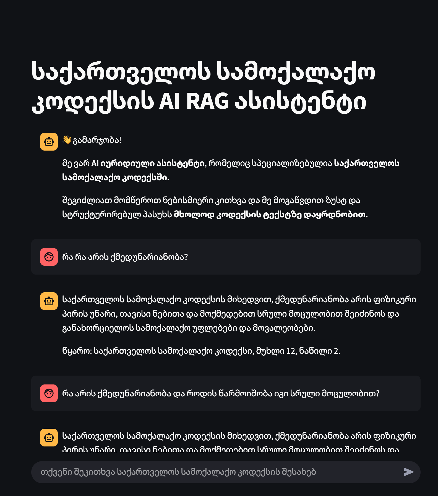
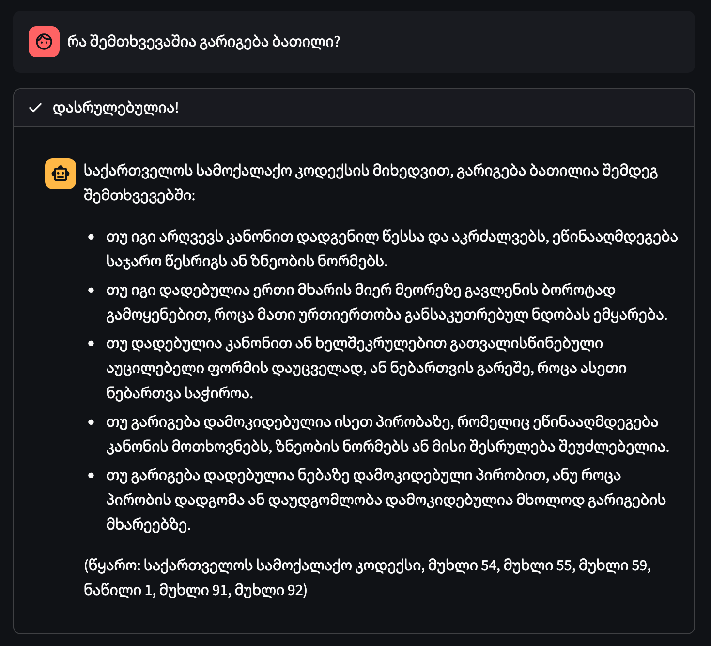

# საქართველოს სამოქალაქო კოდექსის AI ასისტენტი

[](https://opensource.org/licenses/MIT)

RAG (Retrieval-Augmented Generation) არქიტექტურაზე დაფუძნებული AI ასისტენტი, რომელიც შექმნილია საქართველოს სამოქალაქო კოდექსის შესახებ დასმულ კითხვებზე ზუსტი, სტრუქტურული და წყაროზე დამოწმებული პასუხების გასაცემად.

პროექტი იყენებს ჰიბრიდული ძიების (Keyword + Semantic) და ხელახალი დახარისხების (Re-ranking) მექანიზმებს, რათა უზრუნველყოს მაქსიმალურად რელევანტური ინფორმაციის მოძიება და მიწოდება Google Gemini მოდელისთვის.

## 🚀 ძირითადი მახასიათებლები

-   **ჰიბრიდული ძიება**: აერთიანებს BM25 (Keyword-ზე დაფუძნებული) და ვექტორულ (სემანტიკურ) ძიებას ყველაზე რელევანტური კანონის მუხლების მოსაძიებლად.
-   **შედეგების ხელახალი დახარისხება (Re-ranking)**: Embedding cosine similarity-ზე დაყრდნობით ხდება მოძიებული კანდიდატების ხელახალი, მაღალი სიზუსტის დახარისხება.
-   **წყაროზე დამოწმებული პასუხები**: ყოველი პასუხი გენერირებულია *მხოლოდ* მიწოდებულ კონტექსტზე დაყრდნობით და მოიცავს ზუსტ ციტირებას (მუხლის ნომერი).
-   **დომეინის სპეციფიკური მონაცემთა დამუშავება**: სამოქალაქო კოდექსის ტექსტი გადის სპეციალურ დამუშავებას (არასაჭირო ინფორმაციის წაშლა, სემანტიკური დაყოფა), რაც ზრდის სისტემის სიზუსტეს.
-   **ინტერაქტიული ვებ-ინტერფეისი**: აგებულია Streamlit-ის გამოყენებით მარტივი და ინტუიციური მოხმარებისთვის.

## 🖼️ ვიზუალური მაგალითი



## ❓ სატესტო შეკითხვები
-   **ჩემი პროგრამის შესამოწმებლად გთავაზობთ შეკითხვებს საქართველოს სამოქალაქო კოდექსთან დაკავშირებით:**
```bash
    1. რა არის ქმედუნარიანობა და როდის წარმოიშობა იგი სრული მოცულობით?
    2. რა არის იურიდიული პირი და როდის წარმოიშობა მისი უფლებაუნარიანობა?
    3. რა არის ხანდაზმულობის ვადა სახელშეკრულებო მოთხოვნებისთვის?
    4. რა შემთხვევაშია გარიგება ბათილი?
    5. როგორ შეუძლია მოანდერძეს შეცვალოს ან გააუქმოს ანდერძი?
    6. რა არის სავალდებულო წილი და ვის აქვს მისი მიღების უფლება?
```
-   **ასევე გთავაზობთ შესაძლებლობას მარტივად გატესტოთ ჩემი აპლიკაცია დემოს ლინკის დახმარებით თქვენივე ბრაუზერში**
-   **დემოს ლინკი**:  https://civil-code-rag-agent-nmddwoxhqfdfs9fjrgpahc.streamlit.app/

## ⚙️ არქიტექტურა

სისტემა მუშაობს შემდეგი თანმიმდევრობით:

1.  **მომხმარებლის კითხვა** ➡️ შეკითხვა მიიღება Streamlit-ის ინტერფეისიდან.
2.  **ჰიბრიდული ძიება** ➡️ სისტემა ერთდროულად ასრულებს ორ ძიებას:
    -   **Sparse Retrieval (BM25)**: პოულობს ტექსტის ნაწილებს საკვანძო სიტყვების დამთხვევით.
    -   **Dense Retrieval (ChromaDB)**: პოულობს ტექსტის ნაწილებს სემანტიკური მსგავსების მიხედვით.
3.  **შედეგების გაერთიანება** ➡️ ორივე მეთოდით მოძიებული შედეგები ერთიანდება და იფილტრება დუბლიკატებისგან.
4.  **ხელახალი დახარისხება (Re-ranking)** ➡️ Embedding cosine similarity-ით აფასებს გაერთიანებულ შედეგებს და ალაგებს მათ კითხვის რელევანტურობის მიხედვით უმაღლესი სიზუსტით.
5.  **კონტექსტის ფორმირება** ➡️ საუკეთესო 5 შედეგი ერთიანდება კონტექსტში და მომხმარებლის კითხვასთან ერთად იგზავნება LLM-თან.
6.  **პასუხის გენერაცია (Gemini)** ➡️ LLM აგენერირებს პასუხს მკაცრად განსაზღვრული ინსტრუქციებისა და ფორმატის დაცვით.
7.  **პასუხის ჩვენება** ⬅️ საბოლოო, ფორმატირებული პასუხი უბრუნდება მომხმარებელს ინტერფეისში.

## 📂 პროექტის სტრუქტურა
    ```bash
    AI-Agent-RAG/
    ├── code/
    │   ├── rag_pipeline/
    │   │   ├── hybrid_rag.py         # ჰიბრიდული ძიებისა და re-ranking-ის ლოგიკა
    │   │   ├── sparse_retriever.py     # BM25-ზე დაფუძნებული ძიების კლასი
    │   │   ├── generator.py            # LLM-თან კომუნიკაცია და პასუხის გენერაცია
    │   │   └── vector_store.py         # ChromaDB ვექტორულ ბაზასთან მუშაობა
    │   ├── core/
    │   │   └── embeddings.py           # Gemini Embedding მოდელის ინტეგრაცია
    │   ├── processing/
    │   │   ├── data_processing.py    # მონაცემთა დამუშავების მთავარი სკრიპტი
    │   │   ├── chunking.py             # ტექსტის სემანტიკურ ნაწილებად დაყოფა
    │   │   └── text_processing.py      # ტექსტის გასუფთავება არასაჭირო ინფორმაციისგან
    │   └── main.py                     # Streamlit აპლიკაციის მთავარი ფაილი
    ├── data/
    │   ├── chroma_db/                  # ვექტორული ბაზის ფაილები
    │   ├── chunks.json                 # დამუშავებული და დაყოფილი ტექსტი
    │   └── document.docx               # საწყისი დოკუმენტი (სამოქალაქო კოდექსი)
    ├── .env                            # გარემოს ცვლადების ფაილი (API გასაღები)
    ├── .gitignore
    ├── README.md
    └── requirements.txt
    ```

## 🛠️ ინსტალაცია და გაშვება

### წინაპირობები

-   Python 3.9+
-   Google API Key (Gemini მოდელისთვის)

### ინსტრუქცია

1.  **პროექტის კლონირება:**
    ```bash
    git clone [https://your-repository-url.git](https://your-repository-url.git)
    cd AI-Agent-RAG
    ```

2.  **ვირტუალური გარემოს შექმნა და აქტივაცია:**
    ```bash
    # Unix/macOS
    python3 -m venv venv
    source venv/bin/activate

    # Windows
    python -m venv venv
    .\venv\Scripts\activate
    ```

3.  **დამოკიდებულებების (dependencies) ინსტალაცია:**
    ```bash
    pip install -r requirements.txt
    ```

4.  **გარემოს ცვლადების (Environment Variables) დაყენება:**
    -   შექმენით ფაილი პროექტის მთავარ დირექტორიაში სახელად `.env`.
    -   გახსენით `.env` ფაილი და დაამატეთ თქვენი Google API გასაღები:
        ```
        GOOGLE_API_KEY="თქვენი_გასაღები_აქ"
        ```

### აპლიკაციის გაშვება

1.  პირველი გაშვებისას, სისტემა ავტომატურად დაამუშავებს `document.docx` ფაილს, შექმნის `chunks.json`-ს და ვექტორულ ბაზას `data/chroma_db` დირექტორიაში. ეს პროცესი შეიძლება რამდენიმე წუთს გაგრძელდეს.

2.  აპლიკაციის გასაშვებად გამოიყენეთ შემდეგი ბრძანება:
    ```bash
    streamlit run code/main.py
    ```

3.  გაიხსნება ბრაუზერის ახალი ფანჯარა, სადაც შეძლებთ ასისტენტთან მუშაობას.

## 💻 გამოყენებული ტექნოლოგიები

-   **Backend**: Python
-   **Web Framework**: Streamlit
-   **LLM & Embeddings**: Google Gemini
-   **Vector Database**: ChromaDB
-   **Sparse Retrieval**: Rank-BM25
-   **Re-ranking**: Sentence-Transformers (Cross-Encoder)

## 📄 ლიცენზია

პროექტი ვრცელდება MIT ლიცენზიით.[MIT License](LICENSE).